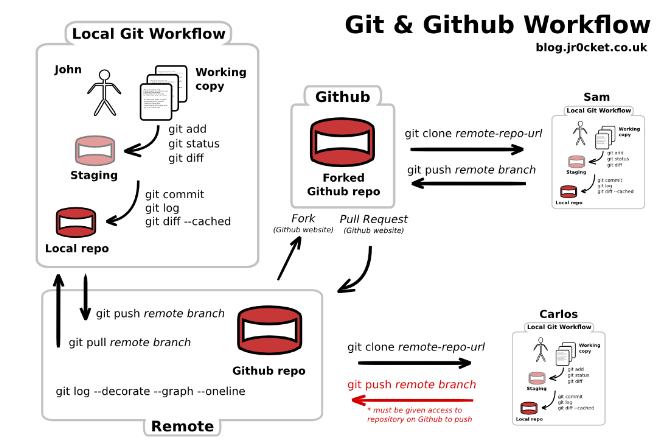
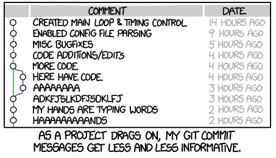
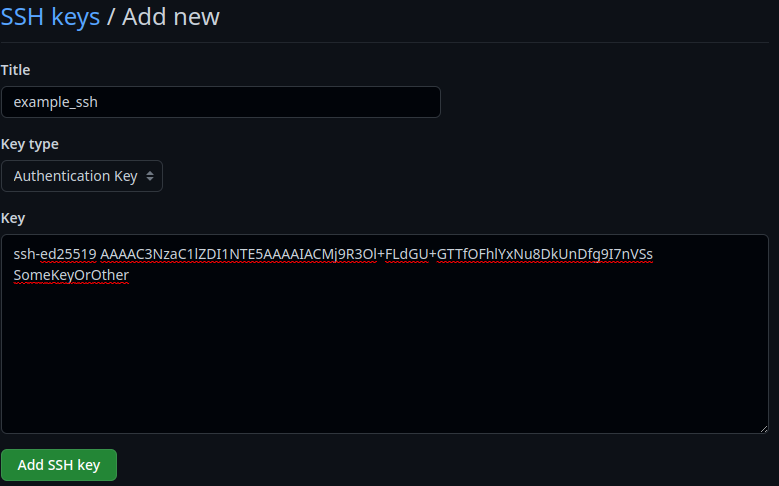

# Git and Github Training

Date: 2023-03-27
Team: Psychology

      
---

## Git/Github

<div style="font-size: 27px">

- Version Control Systems: How to safely organise and backup your software code

- Git: Most popular Version Control System

- GitHub: Version Control System host

</div>


---

## Git Characteristics 

<pdiv style="font-size: 27px">

- A very popular VCS
- Performance
  - Better performance compared to competitors
  - Deals with the data in the file rather than the file properties
- Security
  - Uses SHA-256
- Flexibility
  - Non-linear development
  - Detailed log information

</div>


--- 

## GitHub - What is it and features?

<div style="font-size: 27px">

- Web-based graphical user interface (GUI)
- Features
  - Can act as a project manager
  - Hosts Git repositories
  - Secure with keys


</div>

---

## Fundemental Git Functions

<div style="font-size: 27px">

All commands are prepended with `git`

- `fetch`, `pull`: Get a working copy of a repository

- `add`,`commit`,`push`: Record a change or changes in at least one of the files stored in the repository.

- `branch`: Create a copy of a repository to be worked independently.

- `merge`: Collates changes of two different copies of a repository.

- `log`: Records information of each change within a repository

</div>


---

## Git - Branching


<div style="font-size: 27px">

 - **Main**: The default development branch. Whenever you create a Git repository, a branch named "master" is created, and becomes the active branch. 

- **Develop**: This is another branch, which is a way to edit/develop/test code without changing the Master branch. T

- **Topic**: A regular Git branch that is used by a developer to identify a conceptual line of development. 

</div>

---

## Git Commands Explained

<div style="font-size: 27px">

`clone`​: Get a working copy of the repository​

`fetch`: Update the working copy of the repository without copying or removing any files.​

`pull`: Update the working copy of the repository with copying and removing any files necessary.​

`commit`: Update the working copy with all changes​

`push​`: to the main repository all changes that have been committed to the local working copy.​

`branch​`: Creates a copy of the repository that can be worked independently from the main branch​

`Merge`: Combine two copies of a repository.​ Conflicts may be present.

</div>​

---

## Git workflow



---

<!-- class:_invert -->
## Git `Commit`

 - Interactive approach
   ```sh
   git commit -av
   ```

- Non-interactive
  ```sh
  git commit -m "your message"
  ```


---

## Git Repository Staging Area

<div style="font-size: 27px">

As part of the version control features there is the **Staging Area**. ​

This is feature enables the developer to move files independently of each other  `git add <filename>` to the repository. Of course you can do this all in one go with `git commit -a​`


</div>

--- 


## Git Flow Diagram


---

## Git Beyond Software Development

<div style="font-size: 27px">

- ​Developers​

- Marketing​

- Management​

  - Human Resources​

  - Product Management​

  - Project Budget​

- Customer Support​

</div>

---

## Learning Git

[https://learngitbranching.js.org/​](https://learngitbranching.js.org)


---

## `ssh-keygen`


- **Linux**
  ```sh
  $ ssh-keygen -t ed25519 -C "SomeKeyOrOther"
  ```

- **Windows**
  ```sh
  $ ssh-keygen.exe -t ed25519 -C "SomeKeyOrOther"
  ```

---

## ssh key copy


```sh
$ cat ~/.ssh/id_ed25519.pub

ssh-ed25519 AAAAC3NzaC1lZDI1NTE5AAAAIACMj9R3Ol
+FLdGU+GTTfOFhlYxNu8DkUnDfg9I7nVSs SomeKeyOrOther

```


---

## Authenticating

```sh
$ ssh git@github.com
```
```
CompEng0001! You've successfully authenticated, but GitHub does not provide shell access.
Connection to github.com closed.
```